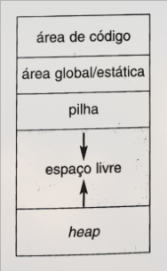

# Ambientes de Execução (_Runtime Environments_)

> Capítulo 7, Compiladores: Princípios e práticas, 2004, Louden e Kenneth

Para que um programa seja executável, faz-se necessária a presença de uma
estrutura pela qual se dá o gerenciamento de memoria e a manutenção das
informações por ele requeridas: um **ambiente de execução**. A maioria das
linguagens de programação se encontram associadas a um ambiente que se enquadra
em uma das três categorias seguintes:

---

1. Baseado em Pilhas

> ex.: C, C++, Pascal e Ada

2. Totalmente estático

> ex.: FORTRAN77

3. Totalmente dinâmico

> encontrado em linguagens funcionais como o LISP.

> [!NOTE] Além destas, existem formas híbridas entre elas.
>
> Mas estas não serão aqui abordadas

---

## Organização de memória durante a execução de programas

É de comum necessidade a todos os ambientes de execução a organização da memória
durante a execução de programas, e aqui explicitaremos os principais mecanismos
pelos quais esta ocorre.

---

### Regiões de memória

A memória alocada para a execução de programas pode ser delimitada em duas
regiões principais:

- _Área de código_: Onde são armazenadas informações imutáveis durante a
  execução (as instruções, os valores constantes) e variáveis globais. Isto é,
  todas as informações para as quais o endereço de memória é conhecido e
  estático.
- _Área de dados_: Todos os demais dados, armazenados conforme cada contexto de
  execução do programa.

---

A área de memória utilizada para a alocação de dados dinâmicos pode ser
organizada de diversas formas. Uma organização típica divide essa memória em

- Área de pilha (_stack_): onde são armazenados dados cuja alocação ocorre na
  forma LIFO (_last in, first out_). Frequentemente esta é utilizada para
  criação de uma pilha de procedimentos (ou funções).

- Área de _heap_: onde são armazenados dinamicamente quaisquer outros dados que
  não seguem essa ordenação (ex.: como fazem os ponteiros na linguagem de
  programação C).

> [!IMPORTANT] "Heap", neste contexto, é uma área de memória linear simples.
>
> Não tem qualquer relação com a estrutura de dados "Heap" vista em algoritmos
> como o Heapsort.

---

Dada a porção de memória alocada para o programa representada como subdivisões
de uma área contígua, temos:

Onde as setas indicam a direção de "crescimento" da pilha e do heap. Ou seja,
novos endereços de memória são alocados de tal forma que o topo da pilha e o
heap convergem a uma mesma posição de memória. Não obstante, a estrutura do
ambiente de execução **não é** contígua: esta faz uso tanto de registradores
quanto memória RAM. Em algumas organizações, a pilha e o heap são alocados em
seções separadas da memória, em vez de ocupar a mesma área.

---

Na pilha de procedimentos ocupam **registros de ativação de procedimentos**, que
contém memória alocada para dados locais de um procedimento ou função, quando
este é acessado. Um registro de ativação é composto por, no mínimo, espaço para
os seguintes elementos:

- Argumentos (ou parâmetros)
- Quaisquer dados locais
- Endereço de retorno

De tal forma que processos podem ser gerados dada a passagem de parâmetros,
persistirem em uma memória local, e eventualmente serem desempilhados em uma
sequência de retorno. Ao conjunto de registros de ativação mantidos em uma pilha
denomina-se o **quadro de pilhas**.

---

### Uso de registradores

Registradores são convenientes, e são utilizados, para armazenar valores
pertinentes ao momento atual da execução de um programa. Sejam estes locais,
globais e, principalmente, temporários. Além destes, processadores usualmente
possuem e reservam registradores ao uso específico do acompanhamento da
execução, são estes:

- **Contador de programa (_program counter_, pc)**: indica na memória da
  instrução a ser executada, é incrementado durante ou após o estágio de busca
  de instrução

- **Ponteiro de pilha (_stack pointer_, sp)**: indica a posição de memória atual
  do topo da pilha.

- **Ponteiro de quadros (_function pointer_, fp)**: indica a posição de memória
  na pilha em que se inicia o armazenamento do registro de ativação corrente.

> [!NOTE] Para que serve o fp?
>
> Enquanto o sp pode mover-se durante a execução de uma função, o fp não se move
> e provê um ponto de referência estável do contexto local desta. Setar o sp
> para a posição do fp implica apagar o contexto local da função (_stack
> unwind_)

- **Ponteiro de argumentos (argument pointer, ap):** aponta para um argumento na
  região de dados reservada para estes na pilha.

> [!NOTE] Para que serve o ap?
>
> O uso do ap é desincentivado em favor de se carregar os valores dos argumentos
> em registradores, mas nos casos em que uma função possui um número variável de
> argumentos, seu uso pode ser necessário.

---

### Sequências de ativação e retorno

Também denominadas enquanto o _prólogo_ e _epílogo_ (de uma função), são o
conjunto de operações pelos quais ocorre, respectivamente:

- A alocação de memória para o registo de ativação;

- A computação e armazenamento de argumentos;

- O armazenamento e o ajuste dos registradores.

E

- A colocação do valor de retorno ao program counter;

- O reajuste dos registros;

- A liberação da memória à partir do registro de ativação.

---

Para que estas ocorram, faz-se necessário, entre a função que chama (ativador) e
a função chamada (ativada),

- que o ativador compute e armazene os argumentos onde o ativado espera
  encontrá-los (seja em registradores ou na pilha)
- que o ativado armazene o estado da máquina no ponto de ativação (incluindo o
  estado dos registradores e o endereço de retorno) para posterior restauração.
  Também, que este retorne um resultado onde o ativador espera encontrá-lo.

> [!IMPORTANT] Aqui marca o final da primeira parte da apresentação

---

## Ambientes de execução totalmente estáticos

## Memória dinâmica

## Mecanismos para passagem de parâmetros

## Ambiente de execução para a linguagem TINY
