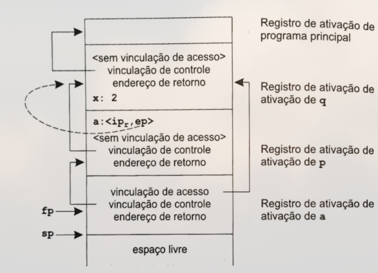

# Ambientes de Execução (_Runtime Environments_)

<!--toc:start-->

- [Introdução](#introdução)
- [Ambientes de execução baseados em pilhas](#ambientes-de-execução-baseados-em-pilhas)
  - [Aspectos gerais de ambientes de execução baseados em pilha](#aspectos-gerais-de-ambientes-de-execução-baseados-em-pilha)
    - [Regiões de memória](#regiões-de-memória)
    - [Registradores](#registradores)
    - [Sequências de ativação e retorno](#sequências-de-ativação-e-retorno)
      - [Sequência de ativação](#sequência-de-ativação)
      - [Sequência de retorno](#sequência-de-retorno)
    - [Dados de comprimento variável](#dados-de-comprimento-variável)
      - [Exemplo](#exemplo-dados-de-comprimento-variável)
    - [Gerenciamento de _heap_](#gerenciamento-de-heap)
      - [Alocação](#alocação)
      - [Liberação](#liberação)
  - [Ambientes de execução baseados em pilha sem procedimentos locais](#ambientes-de-execução-baseados-em-pilha-sem-procedimentos-locais)
    - [Exemplo](#exemplo-ambientes-sem-procedimentos-locais)
  - [Ambientes de execução baseados em pilha com procedimentos locais](#ambientes-de-execução-baseados-em-pilha-com-procedimentos-locais)
    - [Exemplo](#exemplo-ambientes-com-procedimentos-locais)
  - [Ambientes baseados em pilhas com parâmetros de procedimentos](#ambientes-baseados-em-pilhas-com-parâmetros-de-procedimentos)
    - [Exemplo](#exemplo-ambientes-com-parâmetros-de-procedimentos)
- [Ambientes de execução totalmente estáticos](#ambientes-de-execução-totalmente-estáticos)
  - [Exemplo](#exemplo-ambientes-de-execução-totalmente-estáticos)
- [Ambientes de execução totalmente dinâmicos](#ambientes-de-execução-totalmente-dinâmicos)
  - [Coleta de lixo (Garbage collection)](#coleta-de-lixo-garbage-collection)
    - [Marcar e correr (_mark and sweep_)](#marcar-e-correr-mark-and-sweep)
    - [Contrapontos ao uso de coleta de lixo](#contrapontos-ao-uso-de-coleta-de-lixo)
    - [Otimizações](#otimizações)
      - [Parar e copiar](#parar-e-copiar)
      - [Coleta de Lixo Gerativa](#coleta-de-lixo-gerativa)
- [Conclusão](#conclusão)
  <!--toc:end-->

<!--Inicio da parte da Laura -->

## Introdução

Para que um programa seja executável, faz-se necessária a presença de uma
estrutura pela qual se dá o gerenciamento de memória e a manutenção das
informações por ele requeridas: um **ambiente de execução**. Não apenas isso,
mas a escolha do ambiente de execução impacta diretamente o desempenho deste e
as funcionalidades oferecidas pela linguagem de programação com a qual foi
escrito.

É o objetivo deste seminário explicitar os mecanismos pelos quais um ambiente de
execução pode ser criado e manipulado. Além de abarcar os principais tipos de
ambientes de execução disponíveis atualmente.

Para tal, fizemos um resumo do capítulo 7 da obra de Kenneth C. Louden (2004),
_Compiladores: princípios e práticas_, naqueles que consideramos ser os
principais tópicos sobre o tema.

---

A maioria das linguagens de programação se encontram associadas a um ambiente
que se enquadra em uma das três categorias seguintes:

1. Baseado em Pilhas

2. Totalmente estático

3. Totalmente dinâmico

Abordaremos estes em ordem a seguir.

> [!IMPORTANT] Esta é uma lista não exaustiva
>
> Além destas, existem formas híbridas entre estas categorias, mas estas não
> serão aqui abordadas

## Ambientes de execução baseados em pilhas

Iniciamos nossa exploração pelo ambiente de execução baseado em pilhas, por este
ser um modelo o qual nossa audiência pode estar familiarizada em função do
conteúdo didático das aulas de Arquitetura e Organização de Computadores, e do
uso habitual de linguagens de programação que fazem uso deste tipo de ambiente:
o C e o C++.

No que tange este ambiente de execução, existem variações de diferentes
complexidades, começaremos expondo aspectos gerais para depois abordá-los um a
um em ordem crescente de complexidade.

Alguns aspectos do ambiente de execução baseados em pilhas encontram paralelo
nos demais tipos de ambientes, e como tal serão oportunamente retomados em vez
de reiterados.

### Aspectos gerais de ambientes de execução baseados em pilha

#### Regiões de memória

Em um ambiente de execução baseado em pilhas, a memória alocada para a execução
de programas é delimitada em duas regiões principais:

- _Área de código_: Onde são armazenadas informações imutáveis durante a
  execução (as instruções, os valores constantes) e variáveis globais. Isto é,
  todas as informações para as quais o endereço de memória é conhecido e
  estático.
- _Área de dados_: Todos os demais dados, armazenados conforme cada contexto de
  execução do programa.

---

Por vez, a área de dados pode ser delimitadas em outras três regiões principais:

- Área de pilha (_stack_): onde são armazenados dados cuja alocação ocorre na
  forma LIFO (_last in, first out_). Frequentemente esta é utilizada para
  criação de uma pilha de procedimentos (ou funções).

- Área de _heap_: onde são armazenados dinamicamente quaisquer outros dados que
  não seguem essa ordenação.

> [!IMPORTANT] "Heap", neste contexto, é uma área de memória linear simples.
>
> Não tem qualquer relação com a estrutura de dados "Heap" vista em algoritmos
> como o Heapsort.

- Espaço livre: Área de memória disponível para alocação tanto pela pilha quanto
  pelo heap

---

Dada a porção de memória alocada para o programa representada como subdivisões
de uma área contígua, temos:


Onde as setas indicam a direção de "crescimento" da pilha e do heap. Ou seja,
novos endereços de memória são alocados de tal forma que o topo da pilha e o
heap convergem a uma mesma posição de memória. Não obstante, a estrutura do
ambiente de execução **não é** contígua: esta faz uso tanto de registradores
quanto memória RAM. Em algumas organizações, a pilha e o heap são alocados em
seções separadas da memória, em vez de ocupar a mesma área.

---

Na pilha de procedimentos ocupam **registros de ativação de procedimentos**, que
contém memória alocada para dados locais de um procedimento ou função, quando
este é acessado. Um registro de ativação é composto por, no mínimo, espaço para
os seguintes elementos:

- Argumentos (ou parâmetros)
- Quaisquer dados locais
- Endereço de retorno

De tal forma que processos podem ser gerados dada a passagem de parâmetros,
persistirem em uma memória local, e eventualmente serem desempilhados em uma
sequência de retorno. Ao conjunto de registros de ativação mantidos em uma pilha
denomina-se o **quadro de pilhas**.

#### Registradores

Registradores são convenientes, e são utilizados, para armazenar valores
pertinentes ao momento atual da execução de um programa. Sejam estes locais,
globais e, principalmente, temporários. Além destes, processadores usualmente
possuem e reservam registradores ao uso específico do acompanhamento da
execução, são estes:

- **Contador de programa (_program counter_, pc)**: indica na memória da
  instrução a ser executada, é incrementado durante ou após o estágio de busca
  de instrução

- **Ponteiro de pilha (_stack pointer_, sp)**: indica a posição de memória atual
  do topo da pilha.

- **Ponteiro de quadros (_function pointer_, fp)**: indica a posição de memória
  na pilha em que se inicia o armazenamento do registro de ativação corrente.
  Uma cópia deste, denominada _old fp_ também pode ser gerada pela ativação
  seguinte para apontar o registro de ativação imediatamente anterior.

> [!NOTE] Para que serve o fp?
>
> Enquanto o sp pode mover-se durante a execução de uma função, o fp não se move
> e provê um ponto de referência estável do contexto local desta. A partir
> deste, dados locais podem ser encontrados quando armazenados na pilha a partir
> de um deslocamento com relação à fp. Por isso, setar o sp para a posição do fp
> implica apagar o contexto local da função (_stack unwind_).

- **Ponteiro de argumentos (argument pointer, ap):** aponta para um argumento na
  região de dados reservada para estes no registro de ativação.

> [!NOTE] Para que serve o ap?
>
> O uso do ap é opcional e desincentivado em favor de se carregar os valores dos
> argumentos em registradores. Mas, nas arquiteturas que o comportam, e nos
> casos em que uma função possui um número variável de argumentos, este é
> utilizado para indicar a posição na pilha de uma argumento a ser acessado que
> foi armazenado na pilha.

<!--Início da parte do Hélio-->

#### Sequências de ativação e retorno

Também denominadas enquanto o _prólogo_ e _epílogo_, são conjuntos de operações
que precedem e seguem a execução de cada função, respectivamente. As operações
que os compõem são detalhadas à seguir:

##### Sequência de ativação

- Computação dos argumentos e armazenamento destas em posições adequadas no novo
  registro de ativação (por exemplo, ao colocá-los na pilha em ordem);
- Armazenamento do _fp_ (que em breve será o _old fp_);
- Atribuição do valor de _sp_ para o _fp_;
- Armazenamento do endereço de retorno;
- Deslocamento do _pc_ para apontar à porção de código correspondente a função
  atual.

##### Sequência de retorno

- Atribuição do valor de _fp_ para _sp_;
- Atribuição do valor de _old fp_ para _fp_;
- Atribuição do endereço de retorno ao _pc_.

#### Dados de comprimento variável

Nos casos de funções com

- um número de argumentos variável;
- argumentos de tamanho variável;
- ou uma combinação dos casos anteriores;

Faz-se necessário o armazenamento e recuperação dos argumentos na pilha,
registrando-se respetivos comprimentos e deslocamentos dos endereços de memória
‒ tomando como referência o _fp_. Para que isso seja possível, precisa-se:

- Um ou mais registradores para armazenar ponteiros a endereços de memória que
  comportam argumentos, incrementando estes para percorrê-los um a um.

> [!NOTE] Como o anteriormente mencionado _ap_
>
> Expressamente reservado nalgumas arquiteturas para esta finalidade.

- Armazenar na pilha informações de **tamanho** e **quantidade** de elementos,
  para cada tipo de argumento de comprimento variável armazenado.

<a id="exemplo-dados-de-comprimento-variável"></a>

##### Exemplo

O seguinte trecho de código, escrito na linguagem Ada, representa um algoritmo
para retornar a somatória de números inteiros entre um valor mínimo `low` e um
valor máximo `high`:

```ada
type Int_Vetor is
    array (INTEGER rang <>) of INTEGER;

procedure Sum(low, high: INTEGER, A Int_Vector) return INTEGER;
is
    temp: Int_Array(low..high);
begin
    ...
end Sum;
```

---

Uma possível representação da organização de memória para o ambiente de execução
do programa anterior seria:


Assim, um dado elemento `A[i]` pode ser obtido a partir do de um deslocamento
com relação a _fp_, para todo `i < 10`.

> [!IMPORTANT] Distinção no funcionamento de matrizes em Ada e C
>
> Note que, em Ada, `tamanho de A` é armazenado implicitamente em tempo de
> execução. Em C as matrizes são simples ponteiros e o tamanho de uma matriz
> deve ser explicitamente armazenado em outra variável.

#### Gerenciamento de _heap_

Como dito anteriormente, o _heap_ trata-se de um bloco linear de memória de
tamanho variável. O gerenciamento de um heap envolve a duas operações:

- **alocar:** recebe um parâmetro de tamanho (pode ser explícito, usualmente em
  número de bytes, ou implícito) e retorna um ponteiro para o início de um bloco
  de memória disponível com o tamanho correspondente (ou um ponteiro nulo se
  este não houver);

- **liberar**: recebe o ponteiro para um bloco de memória, infere o tamanho
  deste (de forma implícita ou dado um parâmetro de tamanho) e o marca como
  estando disponível para ser sobrescrito.

---

A nomenclatura adotada para estas operações diverge entre diferentes linguagens
de programação, e aqui dotaremos a nomenclatura vista na linguagem C: `malloc` e
`free`. Um método padrão para a implementação destas funções é o uso de uma
lista ligada circular (LLC) de blocos livres, donde memória é obtida com
`malloc` e devolvida com `free`.

---

Considere uma matriz de tamanho arbitrário donde armazenar dados, e nós `Header`
de uma LLC definidos como:


Sendo:

- `next`: um ponteiro para o nó seguinte
- `usedsize`: O tamanho da memória consumida entre o nó presente
- `freesize`: O tamanho da memória disponível entre o nó presente

Estes acompanhados de segmentos de memória ocupado e livre, respectivamente, de
tamanho variável.

---

Considere também um ponteiro `memptr` inicialmente posicionado sobre o `Header`
inicial da LLC. O `memptr` é tal que ao final de cada alocação ou liberação,
**sempre** para um bloco de memória com algum espaço disponível.


 <!--Início da parte da Sandy-->

##### Alocação

A cada invocação de `malloc`,

- Designa-se o nó apontado por `memptr` como sendo a cabeça da LLC, e
  percorre-se esta nó a nó até que um nó com espaço livre suficiente se
  apresente ou, senão, se retorne ao nó apontado por `memptr` (retornando um
  ponteiro nulo)
- Cria-se um novo nó seguinte e a este atribui toda a memória livre disponível
  ao nó apontado por `memptr`, ajustando também o conteúdo do ponteiro next de
  ambos estes nós.
- No novo nó, a memória da matriz é novamente repartida entre ocupada e
  disponível, devolvendo um ponteiro para a região ocupada (que o usuário pode
  utilizar para armazenar dados).
- Finalmente, `memptr` passa a apontar para este novo nó, de maneira que este
  procedimento possa se repetir sucessivamente.

---


##### Liberação

A cada invocação de `free`,

- Percorre-se a lista circular desde `memptr` até o nó anterior ao nó que
  corresponde ao ponteiro fornecido.
- Atribui-se a ocupada e livre do no seguinte como sendo livre ao nó atual.
- Atribui-se o `next` do nó seguinte para o `next` do nó atual, e se apaga o nó
  seguinte.
- Finalmente, `memptr` passa a apontar para o atual nó.

---


### Ambientes de execução baseados em pilha sem procedimentos locais

Nas linguagens de programação em que todos as funções são globais (como a
linguagem C), em termos de controle da execução, faz-se necessário registrar
apenas os endereços do registro de ativação corrente e daquele imediatamente
anterior. Para tal, faz-se uso de dois registradores: _fp_ e outro denominado
_vinculação de controle_, ou _fp old_, cujo valor é armazenado nos dados locais
à função corrente.

<a id="exemplo-ambientes-sem-procedimentos-locais"></a>

#### Exemplo

Considere a seguinte aplicação do algoritmo de Euclides, em C, para computar o
máximo divisor comum (_greatest common divisor, GCD_):

```c
#include <stdio.h>
#include <stdlib.h>

int gcd(int u, int v) {
    if v
        return gcd(v, u % v);
    return u;
}

int main() {
    int u, v;
    scanf(" %d %d", &u, &v);
    printf("%d\n", gcd(u, v));
    return EXIT_SUCCESS;
}
```

---

Do programa anterior resultaria a seguinte organização da memória no ambiente de
execução:


### Ambientes de execução baseados em pilha com procedimentos locais

Em linguagens de programação em que funções podem ser aninhadas, como _Pascal_
ou _Lua_, uma dada função tem acesso para, além de seu contexto local e global,
o contexto local da função que a declarou. Nestes casos, a organização de
memória apresentada necessita de ser acrecida de uma nova variável de controle,
a ser armazenada no registro de ativação: a _vinculação de acesso_. Esta trata
do armazenamento, no registro de ativação da função chamada, do endereço na
pilha do registro da função que a declarou.

<a id="exemplo-ambientes-com-procedimentos-locais"></a>

#### Exemplo

Considere o seguinte programa exemplificativo, escrito em Pascal. Neste, veremos
um trio de funções, `p`, `q` e `r`, onde `p` está para o contexto global e as
demais estão aninhadas no contexto local de `p`:

```pascal
program nonLocalRef;

procedure p;
    var n: integer;

    procedure q;
    begin
        (* referenciar n agora acessará o contexto da função p *)
    end; (* q *)

    procedure r (n: integer);
    begin
        q;
    end; (* r *)

begin (* p *)
    n := 1;
    r(2)
end; (* p *)

begin (* main *)
    p;
end.
```

Para `q` tem-se que `n = 1` pois, muito embora este tenha sido chamado por `r`,
o qual dá a redefinição `n = 2` em seu contexto local, este foi definido por `p`
e carrega o valor para `n` tido neste contexto.

> [!IMPORTANT] Vinculação de acesso é estabelecida em tempo de execução
>
> Disto implica que, em chamadas recursivas, por exemplo, uma função aninhada
> tem acesso somente ao contexto da função que a chamou; e não doutras de mesmo
> tipo que possam ser pregressas a esta.

---

Do programa anterior resultaria a seguinte organização da memória no ambiente de
execução:


<!--Inicio da parte do Theo-->

### Ambientes baseados em pilhas com parâmetros de procedimentos

Por fim, nas linguagens aquelas que não apenas permitem funções locais, mas a
passagens de funções enquanto argumento, como Pascal e Lua (novamente),
introduz-se uma complexidade adicional. Quando a ativação de uma função é
deferida pela sua passagem enquanto argumento, deixa de ser possível ao
compilador computar sua vinculação de acesso durante ativação, conforme foi
descrito anteriormente.

Em vez disso, a vinculação de acesso necessita ser pré-computada e transmitida
juntamente a um ponteiro para o código da função quando esta é transmitida
enquanto parâmetro. Neste contexto, o ponteiro de código e ponteiro de
vinculação de acesso são denominados um par de **ponteiro de instrução**
(_instruction pointer_ `ip`) e **ponteiro de ambiente** (_environment pointer_,
`ep`): `<ip, ep>`.

<a id="exemplo-ambientes-com-parâmetros-de-procedimentos"></a>

#### Exemplo

Considere o seguinte programa escrito em Pascal:

```pascal
program closureEx(output);

procedure p(procedure a);
begin
    a;
end;

procedure q;
    var x: integer;

    procedure r;
    begin
        writeln(x);
    end;

begin
    x := 2;
    p(r);
end; (* q *)

begin (* main *)
    q;
end.
```

Neste, o procedimento `r` é definido em `q`, que o transmite enquanto argumento
para `p`, que denomina `r` como `a` e o executa. Como `r` foi definido em `q`, o
resultado do comando `writeln(x)` acessa o valor de `x` também definido em `q`.

---

A seguir temos dois estados da pilha de registros de procedimentos, o primeiro é
tido imediatamente após a ativação de `p`:


E o segundo imediatamente após a ativação de `a`:



Vê-se que os valores de `<ip, ep>` para `a` já estavam disponíveis em `p` no
momento em que `a` é chamado, e estes informam sua vinculação de acesso.

## Ambientes de execução totalmente estáticos

O ambiente de execução totalmente estático trata-se do ambiente mais simples
disponível, onde todos os dados possuem posições fixas na memória, é denominado
"totalmente estático". Para fazer uso deste ambiente, a linguagem de programação
necessita **não possuir** as condições necessárias à implementação e uso da
pilha e do _heap_:

- Ponteiros;
- Alocação dinâmica;
- Recursão.

Em contrapartida a perda de funcionalidade, ganha-se em desempenho ‒
reduzindo-se o _overhead_ do controle de execução ‒ e acesso a registradores
antes reservados a tal finalidade. Um ambiente deste tipo necessita de apenas um
registrador para acompanhar o atual estado de execução: o registrador de
retorno.

---

A organização do ambiente de execução totalmente estático pode ser representada
da seguinte maneira:


<a id="exemplo-ambientes-de-execução-totalmente-estáticos"></a>

### Exemplo

Considere o seguinte código escrito em FORTRAN77:

```fortran
PROGRAM TEST
COMMON MAXSIZE
INTEGER MAXSIZE
REAL TABLE(10), TEMP
MAXSIZE = 10
READ *, TABLE(1), TABLE(2), TABLE(3)
CALL QUADMEAN(TABLE, 3, TEMP)
PRINT *, TEMP
END

SUBROTINE QUADMEAN(A, SIZE, QMEAN)
COMMON MAXSIZE
INTEGER MAXSIZE, SIZE
REAL A(SIZE), QMEAN, TEMP
INTEGER K
TEMP = 0.0
IF (SIZE.GT.MAXSIZE) .OR. (SIZE.LT.1)) GOTO 99
    DO 10 K = 1, SIZE
        TEMP = TEMP + A(K) * A(K)
10 CONTINUE
99 QMEAN = SQRT(TEMP/SIZE)
RETURN
END
```

Note o tamanho prefixado para o vetor de inteiros e o uso extensivo de variáveis
globais, mesmo para armazenar valores temporários da função `QUADMEAN`.

---

Para o programa anterior, teríamos o seguinte ambiente de execução:


## Ambientes de execução totalmente dinâmicos

Por vez, ambientes de execução baseados em pilha apresentam eles próprios
restrições impostas às linguagens de programação que deles fazem uso: estes não
são capazes de transmitir por referência valores locais aos registros de
ativação, e tentá-lo produziria uma **referência pendente** (comumente referido
como _dangling pointer_ ou _wild pointer_).

---

O exemplo mais simples disso seria a seguinte função em C:

```c
int *dangle(void) {
    int x;
    return &x
}
```

Esta produz uma variável `x` local e retorna um ponteiro para a mesma.
Entretanto, se acessado posteriormente, este ponteiro aponta pra uma região da
memória a qual liberada pela função que gerou o ponteiro e, como tal, pode ser
sobrescrita por qualquer outra informação (e por qualquer outro programa rodando
simultaneamente) dada a continuidade da execução do programa. Ou seja, esta
referência encontra-se em um estado inconsistente.

Pode-se argumentar que esse tipo de uso seria simplesmente um exemplo de mal uso
a ser circundado com boas práticas de programação. De fato, entre linguagens de
programação imperativas, como é o caso do C, predomina esta forma de ambientes
de execução e tais usos são mesmo um risco de segurança para a aplicação.

Mas existe outra classe de linguagens de programação que faz uso corriqueiro
deste recurso, como uma forma de generalizar tanto quanto possível o código
escrito, maximizando assim seu reaproveitamento: linguagens de programação
funcionais como LISP e Haskell.

---

Considere o seguinte código em Haskell:

```haskell
-- Define-se uma função soma, que armazena um valor local x;
SomaX :: Int -> Int -> Int
SomaX x = \y -> x + y  -- Retorna uma função que armazena o valor de X

-- Reaproveita-se esta última para uma função de incremento pré-estabelecido;
somaCinco :: Int -> Int
somaCinco = SomaX 5

-- Finalmente esta é utilizada para somar 10 a 5, produzindo o resultado 15.
resultado :: Int
resultado = somaCinco 10
```

Este é um uso aceitável em Haskell, mas impossível na linguagem C, pois a pilha
referente a função `somaCinco` seria liberada após esta ser inicializada com o
valor `5`, assim descartando-o. Isso só passa a ser possível com o uso de
**ambientes de execução totalmente dinâmicos**.

<!--Inicio da parte do Abreu-->

### Coleta de lixo (Garbage collection)

O que caracteriza um ambiente de execução totalmente dinâmico é sua abordagem
relativamente mais complexa para o gerenciamento de memória, que descarta o uso
da pilha e faz uso exclusivo do heap para o armazenamento de dados. Neste,
continua a se fazer uso de registros de ativação, e com os mesmos parâmetros
vistos anteriormente para veiculação de acesso e controle; mas registros de
ativação permanecem armazenados em memória enquanto perdurarem referências a
estes. Isto vem a requerer

- o acompanhamento das referências durante a execução;
- capacidade para encontrar e liberar porções da memória já inacessíveis em
  instantes arbitrários durante a execução.

Este processo é denominado **coleta de lixo** (_garbage collection_).

#### Marcar e correr (_mark and sweep_)

O uso de `malloc` e `free` para a alocação e liberação dinâmica da memória é o
método manual daquilo que a coleta de lixo se propõe a realizar automaticamente
a cada sequência de ativação. E o algoritmo predominantemente utilizado para a
busca e decisão dos registros de memória a serem alocados ou liberados é
denominado **marcar e varrer**. Seu funcionamento nós descrevemos à seguir:

---

A cada sequência de ativação, ocorrem duas passadas pelo _heap_.

Na primeira passada:

- Percorre-se todos os ponteiros ao heap recursivamente;

> [!NOTE] Noutras palavras,
>
> ponteiros que referenciam objetos no heap e ponteiros que estes objetos
> possuem para outros objetos, sucessivamente);

- Marca-se cada bloco acessado desta forma com um bit de validação, indicando
  que este é "alcançável".

---

Na segunda passada:

- Percorre-se o _heap_ linearmente, liberando a memória de todos os blocos que
  não foram marcados como sendo alcançáveis.

- O novo registro de ativação é armazenado no primeiro bloco de memória a
  satisfazer seu requerimento de memória, **se este houver**.

---

Nos casos em que o requerimento de memória não é satisfeito, ocorre uma terceira
passada:

- Toda a memória ocupada no heap é compactado em endereços de memória no extremo
  oposto do deste, e todos os ponteiros de referência têm seus valores
  atualizados de forma correspondente.

#### Contrapontos ao uso de coleta de lixo

Embora facilitadora ao programador, o uso de coleta de lixo apresenta alguns
problemas:

1. Requer memória adicional para marcar blocos enquanto alcançáveis ou não.
2. Requer pelo menos duas passadas pela memória _heap_ a cada sequência de
   ativação, o que leva a notável atraso de processamento especialmente em
   aplicações que necessitam de rápida resposta, ou resposta em tempo real.

#### Otimizações

##### Parar e copiar

Nesta, o heap é dividido em duas regiões de tamanho variável: a primeira possui
blocos ocupados e a segunda um bloco contíguo de memória livre. A cada sequência
de ativação,

- O novo registro de ativação é alocado no endereço do bloco livre;
- Percorre-se o o região dos blocos ocupados como se fosse marcá-los, mas en vez
  disso se copia a todo bloco alcançado para uma posição consecutiva ao último
  bloco adicionado a região livre.
- Troca-se os papeis: a região livre passa a ser a região ocupada e a região
  ocupada anterior passa a ser a região livre.

São os benefícios desta otimização:

- Não dispende dados adicionais para marcação de blocos
- Compacta memória a cada sequência de ativação

Por outro lado, maiores ganhos de desempenho são perdidos pela necessidade
adicional de se copiar dados a cada iteração.

##### Coleta de Lixo Gerativa

Uma otimização adicional sobre a _parar e copiar_ consiste na divisão da memória
em três partes para acréscimo de uma região para armazenamento permanente.
Nesta, os registros mantidos após uma dada quantidade de sequências de ativação
são adicionados a esta terceira região pela duração total do programa.

O benefício desta otimização é que desta forma apenas registros temporários
restam para serem copiados entre regiões de memória, mas estes são mais
frequentemente descartados. Embora, dessa forma, um registro que não seja mais
utilizado possa chegar à memória permanente, dada uma sequência de ativações
inicial favorável, a perda de memória tende a ser contraposta por um grande
ganho de desempenho.

## Conclusão

Abarcamos os três principais ambientes de execução que fundamentam a uma
variedade de linguagens programação. Foram estes, em ordem de crescente
complexidade, o **totalmente estático**, o **baseado em pilhas** e o
**totalmente dinâmico**. Nota-se que ambientes de execução mais complexos
conferem a linguagem de programação que os implementa maior funcionalidade e
flexibilidade. Enquanto, por outro lado, estes incorrem em perda de desempenho
dado um número maior de recursos destinados a controlar e acompanhar o estado de
execução do programa.

A diversidade dos ambientes de execução destaca a adaptabilidade das linguagens
de programação às diferentes necessidades computacionais. À medida que os
sistemas de software se tornam mais complexos, a interação entre esses ambientes
continua a evoluir, impulsionada pelos imperativos duplos de **eficiência** e
**expressividade**. Compreender essas compensações capacita a cientistas da
computação e desenvolvedores de linguagens a fazer escolhas informadas,
equilibrando as demandas de desempenho, segurança e usabilidade em seu trabalho.
